# Enterprise Active Directory Infrastructure Lab

## Project Objective
The objective of this lab is to design, deploy, and configure a fully functional Microsoft Active Directory (AD) infrastructure within an isolated, virtualized sandbox. This project demonstrates foundational skills in enterprise system administration, including network isolation, centralized identity management, security hardening via Group Policy Objects (GPOs), and automated resource provisioning.

## Technologies & Core Utilities Used
* **Hypervisor:** Oracle VirtualBox (Internal Network Isolation)
* **Operating Systems:** Windows Server 2022 (Domain Controller), Windows 10 Enterprise (Workstation Node)
* **Directory Services:** Active Directory Domain Services (AD DS), DNS
* **Management Consoles:** Server Manager, Active Directory Users and Computers (ADUC), Group Policy Management, Administrative Templates

---

## Technical Execution & Deployment Phases

### Phase 1: Virtual Infrastructure & Network Isolation
To ensure a safe deployment environment completely separated from the host operating system and the local home network, both endpoints were isolated at the hardware layer:
* **Infrastructure Nodes:** Deployed two distinct virtual machines within Oracle VirtualBox.
  * **Management Node:** Windows Server 2022.
  * **Workstation Endpoint:** Windows 10 Enterprise.
* **Network Segregation:** Switched network adapters from default NAT/Bridged modes to an **Internal Network**. This creates an air-gapped, software-defined network switch where the VMs communicate exclusively with each other.

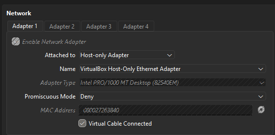

### Phase 2: Domain Controller Configuration (Server-Side)
Before provisioning directory services, the server was prepared to act as an authoritative root node:
* **System Identity:** Renamed the default randomized hostname to `DC01` to comply with standard corporate naming conventions.
* **Static Network Layer:** Configured fixed IPv4 addressing to prevent routing issues within the sandbox:
  * **IP Address:** `192.168.56.10`
  * **Subnet Mask:** `255.255.255.0`
  * **Preferred DNS:** `192.168.56.10` (Pointed to itself to manage local domain name resolution).
* **Directory Services Deployment:** Installed the **Active Directory Domain Services (AD DS)** role via Server Manager and successfully promoted the server to a Domain Controller, establishing a brand-new forest root.

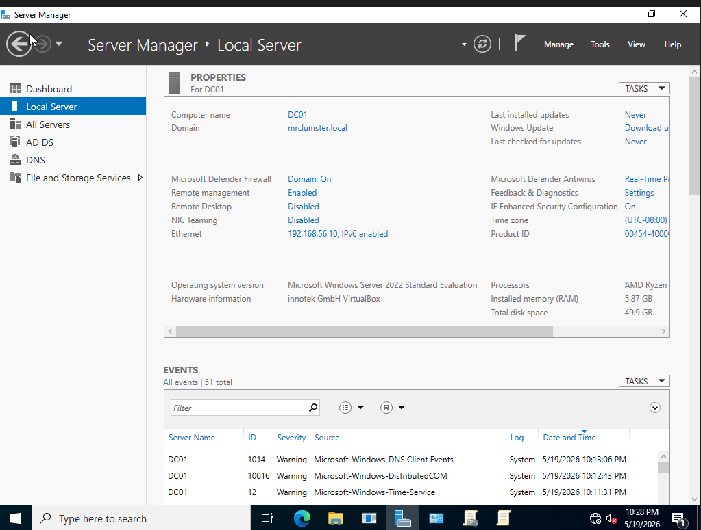
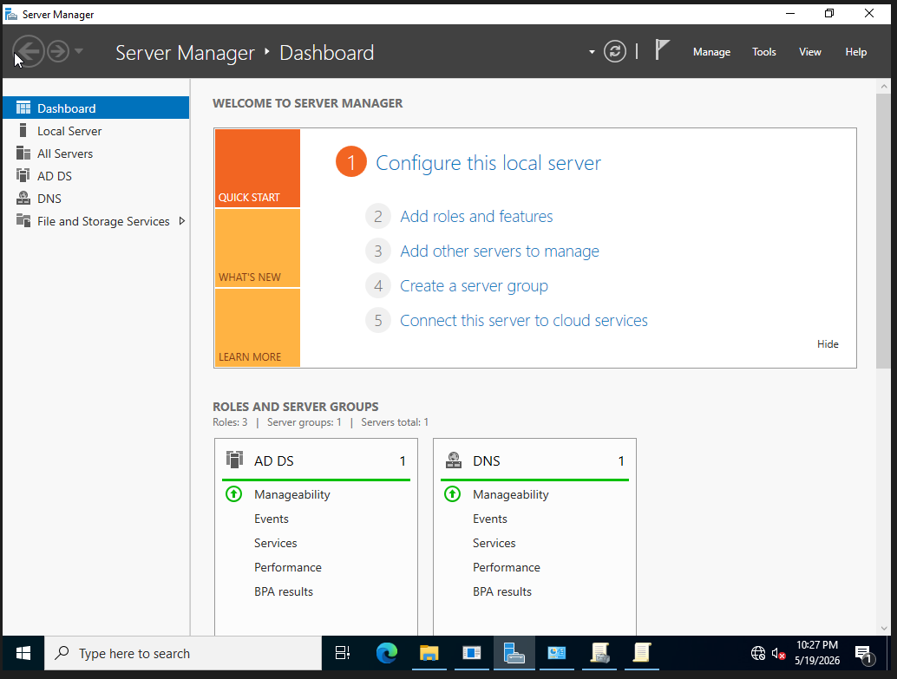

### Phase 3: Client Configuration & Domain Join
The workstation node was configured to securely authenticating against the new central directory:
* **Deployment Provisioning:** Installed Windows 10 Enterprise using a local, offline account to bypass external cloud licensing paths.
* **Network Alignment:** Configured static network properties on the same subnet as `DC01`:
  * **IP Address:** `192.168.56.20`
  * **Subnet Mask:** `255.255.255.0`
  * **Preferred DNS:** `192.168.56.10` (*Critical: Directs all authentication and resolution requests to the Domain Controller*).
* **Domain Integration:** Modified system properties to migrate the client from a standard local Workgroup to the active network domain, finalizing the handshake using Domain Administrator credentials.

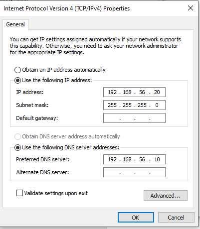
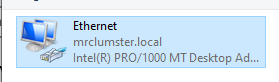

### Phase 4: Centralized Identity & Access Management
With the core architecture established, user administration was centralized on the Domain Controller:
* **Directory Architecture:** Opened the Active Directory Users and Computers (ADUC) console to build a logical organizational hierarchy.
* **Structural Provisioning:** Created a dedicated **Organizational Unit (OU)** folder to separate standard workforce identities from administrative accounts.
* **User Provisioning:** Created a standard, non-privileged employee network account within the custom OU.
* **Validation:** Documented a successful login on the Windows 10 client machine using the newly created standard network credentials, confirming cross-machine authentication.

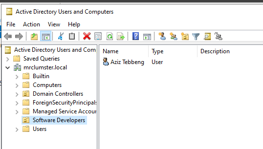
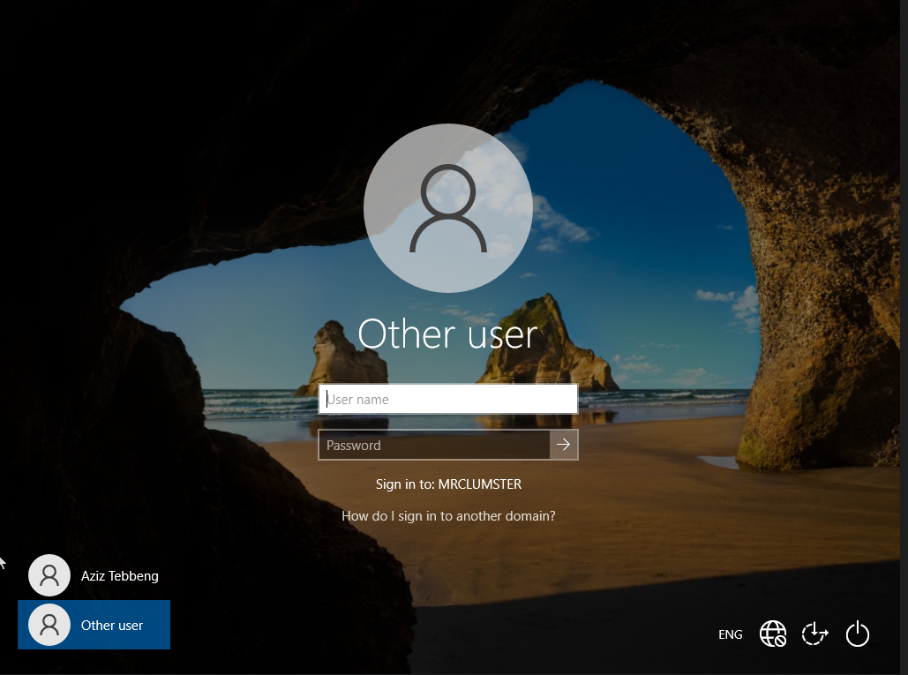

### Phase 5: Group Policy Management (GPO) & Workstation Hardening
To eliminate the manual configuration of individual computers, Group Policy Objects were deployed to automate and scale system security:
* **Cryptographic & Password Enforcement:** Edited the Default Domain Policy to enforce strict security parameters across the entire domain forest:
  * **Minimum Password Length:** Raised to `12 characters`.
  * **Complexity Requirements:** Enabled (Enforcing uppercase, lowercase, numbers, and special characters).
* **Workstation Attack-Surface Reduction:** Created a target-specific GPO named `Standard User Restrictions` and linked it directly to the employee OU. 
  * **Control Panel Lockdown:** Enabled *Prohibit access to Control Panel and PC settings*.
  * **CLI Restriction:** Enabled *Prevent access to the command prompt*.
* **Defensive Verification:** Authenticated as the standard user on the Windows 10 client and confirmed that both the Command Prompt and Control Panel were strictly inaccessible, mitigating local privilege escalation threats.

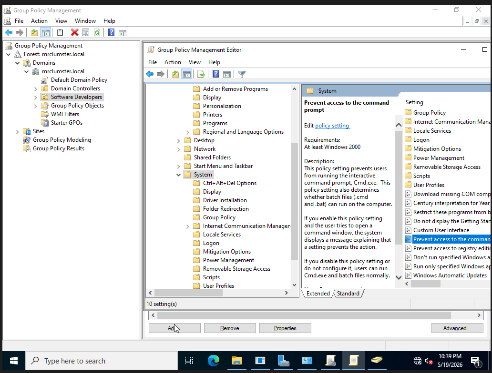
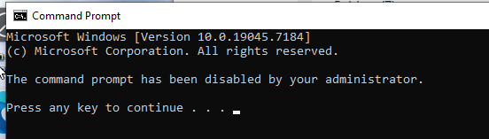

### Phase 6: Enterprise File Sharing & Permissions
This phase establishes structured corporate storage adhering strictly to the security principle of least privilege:
* **File Server Provisioning:** Created a root network repository directory named `Company_Share` on `DC01`.
* **Access Control Lists (ACLs):** Configured strict NTFS security policies:
  * Disabled permission inheritance to clear default broad access.
  * Explicitly stripped out the generic local "Users" group.
  * Added the target standard employee account with explicit **Modify** permissions.
* **Automated Drive Mapping:** Bypassed manual connection paths by utilizing the `Standard User Restrictions` GPO to deploy a User Preference Drive Map. 
* **Outcome:** Configured the folder to instantly mount as the network **`Z:` Drive** upon workstation authentication. Verified that the mapped drive automatically appears within File Explorer on the client machine.

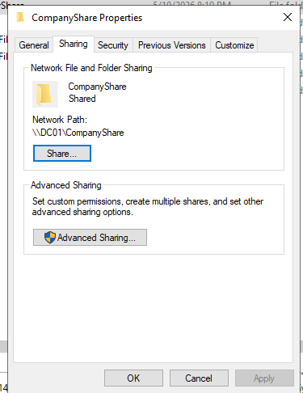
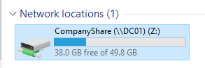

---

## Core Competencies Demonstrated
1. **Network Design & Subnetting:** Configuring isolated host-only virtualization architectures and private IPv4 address allocation.
2. **Enterprise Identity Management:** Provisioning hierarchical ADUC objects and corporate credentials.
3. **System Hardening:** Implementing strict GPO administrative templates to restrict administrative tools from standard operators.
4. **Access Control Management:** Overriding default inherited security file permissions to implement granular NTFS controls.
